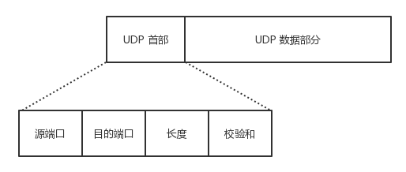
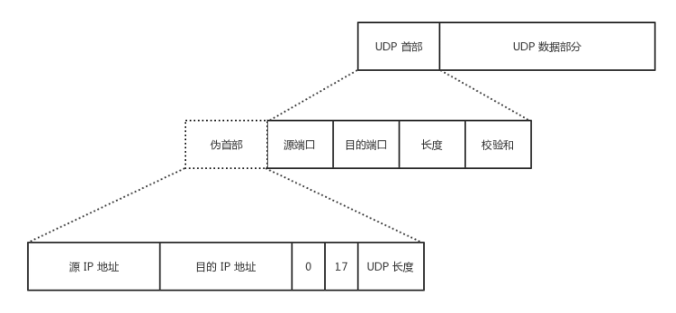

## HTTP篇
### 1.HTTP 缓存有哪些实现方式？
HTTP 缓存有两种实现方式，分别是强制缓存和协商缓存。
#### 什么是强制缓存？
- 强制缓存指的是只要浏览器判断缓存没有过期，就直接用浏览器的本地缓存，决定是否使用缓存的**主动性在浏览器**这里。
- 强缓存是利用下面两个HTTP相应头部（Response Header）字段实现的，它们用来表示资源在客户端的有效期
1. **Cache-Control** 是一个相对时间
2. **Expires** 是一个绝对时间
如果同时有这两个字段的话，**Cache-Control** 字段的优先级较高

#### 什么是协商缓存？
- 304：服务器告诉浏览器可以使用本地缓存的资源
- 协商缓存就是与服务端协商之后，通过协商结果来判断是否使用本地缓存。
- 协商缓存可以基于两种头部来实现
1. 请求头部的**If-Modified-Since** 配合相应头部的 **Last_Modified** 
2. 请求头部中的 **If-None-Match** 字段与响应头部中的 **ETag** 字段（唯一标识相应资源），

### [HTTP各版本和HTTPS](https://xiaolincoding.com/network/2_http/http_interview.html#http-%E7%89%B9%E6%80%A7)

## TCP篇
- TCP（Transmission Control Protocol，传输控制协议）是一种**面向连接的、可靠的、基于字节流**的传输层通信协议，其传输的单位是报文段（Segment）。

- 特征：
    - 面向连接
    - 只能点对点（一对一）通信
    - 可靠交互
    - 全双工通信
    - 面向字节流

- TCP 如何保证可靠传输：
    - 确认和超时重传
    - 数据合理分片和排序
    - 流量控制（滑动窗口）
    - 拥塞控制（拥塞窗口）
    - 数据校验

- TCP报文结构  

    TCP首部(20-60bytes的可变长头部)         TCP数据部分

- TCP首部

| 字段             | 描述                       | 大小       |
|------------------|----------------------------|------------|
| 源端口           | source port               | 16 bits    |
| 目的端口         | destination port          | 16 bits    |
| 序号             | sequence number           | 32 bits    |
| 确认号           | acknowledgement number    | 32 bits    |
| 数据偏移         | data offset               | 4 bits     |
| 保留             | reserved                  | 6 bits     |
| URG 标志         | urgent pointer flag (U)   | 1 bit      |
| ACK 标志         | acknowledgement flag (A)  | 1 bit      |
| PSH 标志         | push function flag (P)    | 1 bit      |
| RST 标志         | reset flag (R)            | 1 bit      |
| SYN 标志         | synchronize flag (S)      | 1 bit      |
| FIN 标志         | finish flag (F)           | 1 bit      |
| 窗口大小         | window size               | 16 bits    |
| 校验和           | checksum                  | 16 bits    |
| 紧急指针         | urgent pointer            | 16 bits    |
| TCP 选项         | TCP options               | 可变长度    |

- TCP标志位（tcp flags） 分别为 URG、ACK、PSH、RST、SYN 和 FIN，每个位为 1 bit,含义如下：

    - URG：紧急比特（urgent），当 URG＝1 时，表明紧急指针字段有效，代表该封包为紧急封包。它告诉系统此报文段中有紧急数据，应尽快传送(相当于高优先级的数据)， 且上图中的 Urgent Pointer 字段也会被启用。
    - ACK：确认比特（Acknowledge）。只有当 ACK＝1 时确认号字段才有效，代表这个封包为确认封包。当 ACK＝0 时，确认号无效。
    - PSH：（Push function）若为 1 时，代表要求对方立即传送缓冲区内的其他对应封包，而无需等缓冲满了才送。
    - RST：复位比特(Reset)，当 RST＝1 时，表明 TCP 连接中出现严重差错（如由于主机崩溃或其他原因），必须释放连接，然后再重新建立运输连接。
    - SYN：同步比特(Synchronous)，SYN 置为 1，就表示这是一个连接请求或连接接受报文，通常带有 SYN 标志的封包表示『主动』要连接到对方的意思。
    - FIN：终止比特(Final)，用来释放一个连接。当 FIN＝1 时，表明此报文段的发送端的数据已发送完毕，并要求释放运输连接。

- TCP options 选项的大小是可变的，根据具体的TCP实现和协议需求可以有所不同。
- 表格中未列出数据部分的大小，因为它依赖于具体的传输内容。

### 常见的TCP options字段
- NOP（No Operation）：用于填充，使选项字段对齐到4字节边界。
    - 大小：1字节。
- EOL（End of Option List）：表示选项列表的结束。
    - 大小：1字节。
- MSS（Maximum Segment Size）：指定发送方愿意接收的最大TCP段大小。
    - 大小：4字节。
- Window Scale：用于扩大窗口大小，支持更大的流量控制窗口。
    - 大小：3字节。
- SACK Permitted（Selective Acknowledgment Permitted）：表示发送方支持选择性确认（SACK）。
    - 大小：2字节。
- SACK（Selective Acknowledgment）：用于选择性确认丢失的段，允许接收方通知发送方哪些数据段已成功接收。
    - 大小：可变，通常为8字节的倍数。
- Timestamp：用于时间戳和往返时间（RTT）测量。
    - 大小：10字节。

### TCP黏包问题
TCP 是一个基于字节流的传输服务（UDP 基于报文的），“流” 意味着 TCP 所传输的数据是没有边界的。所以可能会出现两个数据包黏在一起的情况。
解决

- 发送定长包。如果每个消息的大小都是一样的，那么在接收对等方只要累计接收数据，直到数据等于一个定长的数值就将它作为一个消息。
- 包头加上包体长度。包头是定长的 4 个字节，说明了包体的长度。接收对等方先接收包头长度，依据包头长度来接收包体。
- 在数据包之间设置边界，如添加特殊符号 \r\n 标记。FTP 协议正是这么做的。但问题在于如果数据正文中也含有 \r\n，则会误判为消息的边界。
- 使用更加复杂的应用层协议。

### TCP流量控制
流量控制（flow control）就是让**发送方**的发送速率不要太快，要让**接收方**来得及接收。
- 方法：滑动窗口
    - 窗口大小字段：接收方在TCP首部中的窗口大小字段指示当前可接收的字节数。
    - 动态调整窗口大小：接收方在发送确认（ACK）时更新窗口大小，发送方根据这个值调整发送的数据量。
    - 零窗口和窗口探测：当接收方的缓冲区满时，窗口大小字段变为零，发送方停止发送数据，并定期发送窗口探测数据段，询问接收方的窗口大小。

### TCP拥塞控制
拥塞控制(congestion control)就是防止过多的数据注入到**网络**中，这样可以使网络中的路由器或链路不致过载。
- 拥塞控制和流量控制的区别：
    - 流量控制的主要目的是防止发送方发送数据的速度超过接收方处理数据的能力，从而避免**接收方的缓冲区溢出**。

## UDP篇
- UDP（User Datagram Protocol，用户数据报协议）是 OSI（Open System Interconnection 开放式系统互联） 参考模型中一种无连接的传输层协议，提供面向事务的简单不可靠信息传送服务，其传输的单位是数据报（Datagram）。
- 特征：
    - 无连接
    - 尽最大努力交付
    - 面向报文
    - 没有拥塞控制
    - 支持一对一、一对多、多对一、多对多的交互通信
    - 首部开销小

- UDP 报文结构  

- UDP首部  

## TCP 与 UDP 的区别

- TCP 面向连接，UDP 是无连接的；
- TCP 提供可靠的服务，也就是说，通过 TCP 连接传送的数据，无差错，不丢失，不重复，且按序到达；UDP 尽最大努力交付，即不保证可靠交付
- TCP 的逻辑通信信道是全双工的可靠信道；UDP 则是不可靠信道
- 每一条 TCP 连接只能是点到点的；UDP 支持一对一，一对多，多对一和多对多的交互通信
- TCP 面向字节流（可能出现黏包问题），实际上是 TCP 把数据看成一连串无结构的字节流；UDP 是面向报文的（不会出现黏包问题）
- UDP 没有拥塞控制，因此网络出现拥塞不会使源主机的发送速率降低（对实时应用很有用，如 IP 电话，实时视频会议等）
- TCP 首部开销20字节；UDP 的首部开销小，只有 8 个字节

### 从输入URL到页面返回发生了什么 [这里](https://zhuanlan.zhihu.com/p/133906695)