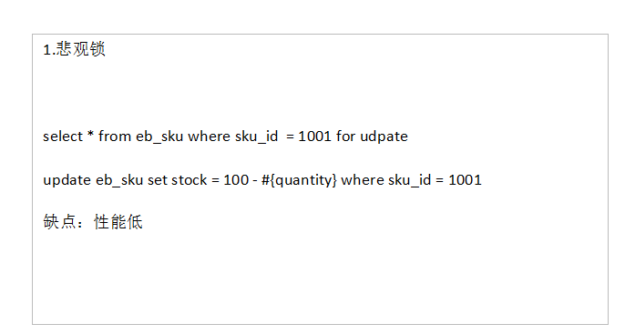
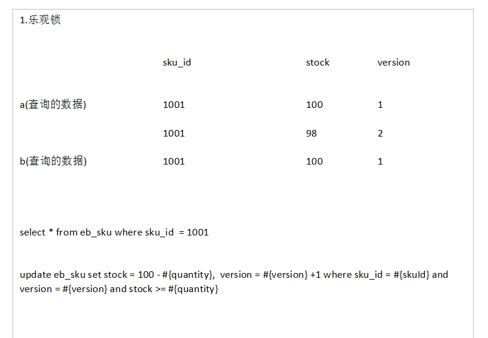

## 数据库的乐观锁和悲观锁是什么？
确保在多个事务同时存取数据库中同一数据时不破坏事务的隔离性和统一性以及数据库的统一性，乐观锁和悲观锁是并发控制主要采用的技术手段。
### 悲观锁：假定会发生并发冲突，屏蔽一切可能违反数据完整性的操作
在查询完数据的时候就把事务锁起来，直到提交事务
- 实现方式：使用数据库中的锁机制
### 乐观锁：假设不会发生并发冲突，只在提交操作时检查是否违反数据完整性。
在修改数据的时候把事务锁起来，通过version的方式来进行锁定
- 实现方式：使用version版本或者时间戳

- 悲观锁：
- 
- 乐观锁：
- 

## MySQL中InnoDB引擎的行锁是通过加在什么上完成
InnoDB是基于索引来完成行锁
- 例: select * from tab_with_index where id = 1 for update;  

for update 可以根据条件来完成行锁锁定,并且 id 是有索引键的列,如果 id 不是索引键那么InnoDB将完成表锁,,并发将无从谈起