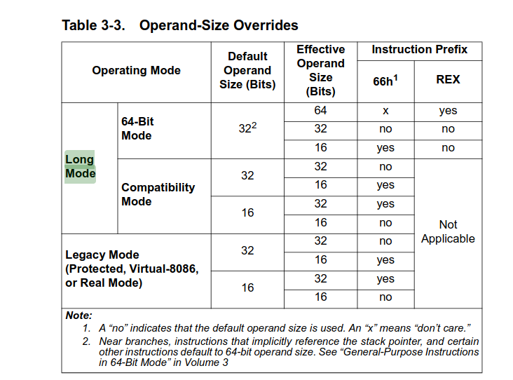

## 计算机从启动电源到进入界面发生了什么？
1. bios电自检(POST:power on system test):确认硬件是可用的，没有被损坏（代表CPU可用）
2. cpu去实行bios的指令，根据内部的Boot Sequence（引导顺序），找到引导设备，如果找不到可引导设备就启动失败！
3. 找到可引导设备后，读取该设备的第一个扇区，即MBR，里面前446 Bytes 包含引导程序1，然后跳转到引导程序2
4. 内核初始化进程等各种init，比如initrd initramfs,已经把控制权给os了

- 相关名词解释:
    1. BIOS(Basic input output system):是在存储在主板ROM里面的一个固件，并为操作系统提供基本的硬件抽象层。里面记录了主机板的芯片集与相关设置，启动设备的搜索顺序和硬盘大小与类型等。
    2. Boot Sequence（引导顺序）:决定了计算机在启动时依次检查哪些设备以寻找可引导的操作系统。引导顺序通常可以在BIOS/UEFI设置界面中配置，常见的引导设备包括：
        1. 硬盘（HDD/SSD）
        2. 光盘驱动器（CD/DVD）
        3. USB设备
        4. 网络启动（PXE）
    3. MBR:Master Boot Record（主引导程序）:MBR是硬盘的第一个扇区，大小为512字节。MBR包含以下几个部分：
        1. 引导程序1（这个就被称作是**bootloader**）：前446字节，包含引导加载程序的第一阶段代码。（负责查找并装载引导加载程序的下一阶段（通常位于硬盘的特定位置））
        （引导程序2就是所谓的**GRUB的核心映像**）
        2. 分区表：接下来的64字节，包含四个分区表项，每个分区表项16字节。
        3. 签名：最后2字节，通常是0x55AA，用于标识这是一个有效的MBR。

- Boot Sequence决定启动设备：当计算机启动时，BIOS/UEFI根据引导顺序依次检查各个设备，一旦找到可引导设备（如硬盘），BIOS/UEFI会读取该设备的第一个扇区，即MBR。
- 读取和执行MBR：BIOS/UEFI将MBR加载到内存中，并执行其中的引导程序1代码。MBR中的引导程序1代码负责查找并加载引导加载程序的下一阶段（我称之为引导程序2）
- 引导程序2：这是GRUB的核心映像，由于它比较大，所以无法被直接写入MBR里面。此阶段被加载并执行后，通常会提供一个菜单(就是我们开机按F8看到的所谓bios界面)，允许用户选择要启动的操作系统或内核。最终，引导加载程序会加载操作系统内核，并将控制权交给内核，完成启动过程。

- 补充：CPU复位（又爱又恨的cpu reset）：
电源开启后，CPU会进行复位操作，复位后CPU会从一个预定义的地址开始执行指令。
对于x86架构的CPU，这个地址通常是0xFFFF0，这是BIOS固件的入口地址。

## 内存管理相关

- 在计算机启动过程中，实模式和保护模式是两种不同的CPU工作模式。以下是各个阶段对应的模式：
### 实模式（Real Mode）
- 只能访问20bits（1M）的内存,由两个16bits的寄存器组成，也就是16bit访问1M内存
#### 什么是实模式？
- 实模式：其中形如0x1000:0x0010这样的寻址形式，对应的目标位置物理地址为(0x1000 << 4) + 0x0010 = 0x10010。前一部分称为段地址，后一部分称为段内偏移。两个地址数值上必须限定在16位宽度。两部分合起来计算出的物理地址位宽限定在20位宽度。
- 举例子：0xFFFF:0xFFFF = 0xFFFF << 4 + 0xFFFF = 0x10FFEF，这样的一个物理地址至少需要21个比特位来表达，就超过了20个比特位的限制。所以，0xFFFF:0xFFFF实际的物理地址为0xFFEF。超出20个比特位部分被舍弃掉了。

#### 启动的哪些阶段是实模式？
1. BIOS初始化和POST：在电源开启后，CPU reset并进入实模式。BIOS固件开始执行，进行硬件自检（POST）和初始化。在实模式下，CPU可以直接访问内存地址，且只能访问1MB的内存空间。
2. 引导加载程序的第一阶段：BIOS根据引导顺序查找启动设备，并读取设备的第一个扇区（MBR）。MBR中的引导程序（前446字节）在实模式下执行，负责加载引导加载程序的下一阶段。
#### 实模式的缺点：
1. 实模式下操作系统和用户程序属于同一特权级，这哥俩平起平坐，没有区别对待。
2. 用户程序所引用的地址都是指向真实的物理地址，也就是说逻辑地址等于物理地址，实实在在地指哪打哪。
3. 用户程序可以自由修改段基址，可以不亦乐乎地访问所有内存，没人拦得住。  
    以上 3 个原因属于安全缺陷，没有安全可言的 CPU 注定是不可依赖的，这从基因上决定了用户程序乃至操作系统的数据都可以被随意地删改，一旦出事往往都是灾难性的，而且不容易排查。

4. 访问超过 64KB 的内存区域时要切换段基址，转来转去容易晕乎。
5. 一次只能运行一个程序，无法充分利用计算机资源。
6. 共 20 条地址线，最大可用内存为 1MB，这即使在 20 年前也不够用

### 保护模式（Protected Mode）
- 保护模式需开启分页机制下，开启分页机制前，需要准备好页目录表，页表。并将页目录表的物理地址加载到CR3控制寄存器。进入保护模式后，再置位CR0.PG可开启分页机制。
#### 启动的哪些阶段是保护模式？
- 引导加载程序的第二阶段：引导加载程序的第二阶段代码（如GRUB）通常会切换到保护模式。在保护模式下，CPU可以访问更多的内存（超过1MB），并且支持内存保护、多任务等高级功能。
- 加载操作系统内核：引导加载程序在保护模式下加载操作系统内核。操作系统内核启动后，继续在保护模式下运行，进行进一步的初始化和配置。

### 长模式（Long Mode）又称作 IA-32e Mode
#### 什么是长模式？
- 进入64位的x64处理器时代后，产生了一种新的运行模式，叫Long Mode（intel手册里还把它叫做IA-32e Mode），传统的三种模式则被统称为Legacy Mode。Long Mode又分为2种子模式，分别是64位长模式（64-Bit Mode）和64位兼容模式（Compatibility Mode）。
- 因为Long Mode使用64位虚拟地址，所以不管是64-Bit Mode还是Compatibility Mode的，都要求操作系统和工具链必须是64位的，其中64-Bit Mode又要求应用程序也得是64位的（纯纯的64位啊）。
- 因此，现存的32位应用程序可以不经重新编译就在处于Compatibility Mode的64位操作系统上运行，但要在处于Long Mode的64位操作系统上运行，就必须重新编译了。
#### 什么时候是长模式？
- 如果是64位操作系统，引导加载程序会在保护模式下加载内核，然后内核会切换到长模式。

### 兼容模式(Compatibility mode)
- CPU兼容模式：是长模式（Long Mode）的一部分，在x86-64架构的处理器中，兼容模式允许64位处理器运行32位或16位的操作系统和应用程序。不细说了
### 总结
实模式：BIOS初始化和POST、引导加载程序的第一阶段。
保护模式：引导加载程序的第二阶段、加载操作系统内核及其后的操作。
长模式：如果是64位操作系统（前提是硬件支持64bits），引导加载程序会在保护模式下加载内核，然后内核会切换到长模式。
兼容模式:是长模式（Long Mode）的一部分，但它限制了处理器的功能，使其能够运行旧的32位或16位代码。

参考：
https://zhuanlan.zhihu.com/p/69334474
https://blog.51cto.com/u_5122542/906655
