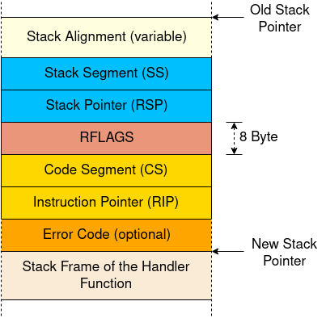

## 中断相关
### 中断调用约定

异常触发十分类似于函数调用：CPU会直接跳转到处理函数的第一个指令处开始执行，执行结束后，CPU会跳转到返回地址，并继续执行之前的函数调用。

然而两者最大的不同点是：函数调用是由编译器通过 call 指令主动发起的，而错误处理函数则可能会由**任何** 指令触发。要了解这两者所造成影响的不同,我们需要更深入的追踪函数调用。

调用约定 指定了函数调用的详细信息，比如可以指定函数的参数存放在哪里（寄存器，或者栈，或者别的什么地方）以及如何返回结果。在 x86_64 Linux 中，以下规则适用于C语言函数（指定于 System V ABI 标准）：

    前六个整型参数从寄存器传入 rdi, rsi, rdx, rcx, r8, r9
    其他参数从栈传入
    函数返回值存放在 rax 和 rdx

注意，Rust并不遵循C ABI，而是遵循自己的一套规则，即 尚未正式发布的 Rust ABI 草案，所以这些规则仅在使用 extern "C" fn 对函数进行定义时才会使用。

### 在 x86_64 架构下，C调用约定指定了这些寄存器分类  
#### 保留寄存器:callee-saved
- rbp, rbx, rsp, r12, r13, r14, r15
#### 临时寄存器:caller-saved
- rax, rcx, rdx, rsi, rdi, r8, r9, r10, r11
CPU在遇到中断发生时是这么处理的：

1. 对齐栈指针: 任何指令都有可能触发中断，所以栈指针可能是任何值，而部分CPU指令（比如部分SSE指令）需要栈指针16字节边界对齐，因此CPU会在中断触发后立刻为其进行对齐。
2. 切换栈 （部分情况下）: 当CPU特权等级改变时，例如当一个**用户态程序**触发CPU异常时，会触发栈切换。该行为也可能被所谓的**中断栈表**配置，在特定中断中触发。
3. 压入旧的栈指针: 当中断发生后，栈指针对齐之前，CPU会将栈指针寄存器（rsp）和栈段寄存器（ss）的数据入栈，由此可在中断处理函数返回后，恢复上一层的栈指针。
4. 压入并更新 RFLAGS 寄存器: RFLAGS 寄存器包含了各式各样的控制位和状态位，当中断发生时，CPU会改变其中的部分数值，并将旧值入栈。
5. 压入指令指针: 在跳转中断处理函数之前，CPU会将指令指针寄存器（rip）和代码段寄存器（cs）的数据入栈，此过程与常规函数调用中返回地址入栈类似。
6. 压入错误码 （针对部分异常）: 对于部分特定的异常，比如 page faults ，CPU会推入一个错误码用于标记错误的成因。
7. 执行中断处理函数: CPU会读取对应IDT条目中描述的中断处理函数对应的地址和段描述符，将两者载入 rip 和 cs 以开始运行处理函数。
所以 中断栈帧 看起来是这样的：

#### Double Fault
简而言之，double fault 就是当CPU执行错误处理函数失败时抛出的特殊异常。比如，你没有注册在 IDT 中注册对应 page fault 异常的处理函数，然后程序偏偏就抛出了一个 page fault 异常，这时候就会接着抛出 double fault 异常。这个异常的处理函数就比较类似于具备异常处理功能的编程语言里的 catch-all 语法的效果，比如 C++ 里的 catch(...) 和 JAVA/C# 里的 catch(Exception e)。

double fault 的行为和普通异常十分相似，我们可以通过在IDT中注册 8 号位的处理函数来拦截该异常。这个处理函数十分重要，如果你不处理这个异常，CPU就会直接抛出 triple fault 异常，该异常无法被任何方式处理，而且会直接导致绝大多数硬件强制重启。
##### Double Faults 的成因

在解释这些部分情况之前，我们需要先明确一下 double faults 的成因，上文中我们使用了一个模糊的定义：

- double fault:就是当CPU执行错误处理函数失败时抛出的特殊异常。

但究竟什么叫 “调用失败” ？没有提供处理函数？处理函数被换出内存了？或者处理函数本身也出现了异常？

比如以下情况出现时：

- 如果 breakpoint 异常被触发，但其对应的处理函数已经被换出内存了？
- 如果 page fault 异常被触发，但其对应的处理函数已经被换出内存了？
- 如果 divide-by-zero 异常处理函数又触发了 breakpoint 异常，但 breakpoint 异常处理函数已经被换出内存了？
- 如果我们的内核发生了栈溢出，意外访问到了 guard page ？

幸运的是，AMD64手册[PDF](https://www.amd.com/system/files/TechDocs/24593.pdf)给出了一个准确的定义（在8.2.9这个章节中）。 根据里面的说法，“double fault” 异常**会**在执行主要（一层）异常处理函数时触发二层异常时触发。 这个“会”字十分重要：只有特定的两个异常组合会触发 double fault。 这些异常组合如下：
| 一层异常                | 二层异常                                                                 |
|-------------------------|--------------------------------------------------------------------------|
| Divide-by-zero,         | Invalid TSS, Segment Not Present, Stack-Segment Fault, General Protection Fault |
| Invalid TSS,            | Invalid TSS, Segment Not Present, Stack-Segment Fault, General Protection Fault |
| Segment Not Present,    | Invalid TSS, Segment Not Present, Stack-Segment Fault, General Protection Fault |
| Stack-Segment Fault,    | Invalid TSS, Segment Not Present, Stack-Segment Fault, General Protection Fault |
| General Protection Fault| Invalid TSS, Segment Not Present, Stack-Segment Fault, General Protection Fault |
|-------------------------|--------------------------------------------------------------------------|
| Page Fault              | Page Fault, Invalid TSS, Segment Not Present,|
|                         | Stack-Segment Fault, General Protection Fault |

所以那些假设里的 divide-by-zero 异常处理函数触发了 page fault 并不会出问题，只会紧接着触发下一个异常处理函数。但如果 divide-by-zero 异常处理函数触发的是 general-protection fault，则一定会触发 double fault。

那么根据上表，我们可以回答刚刚的假设中的前三个：

1. 如果 breakpoint 异常被触发，但对应的处理函数被换出了内存，page fault 异常就会被触发，并调用其对应的异常处理函数。
2. 如果 page fault 异常被触发，但对应的处理函数被换出了内存，那么 double fault 异常就会被触发，并调用其对应的处理函数。
3. 如果 divide-by-zero 异常处理函数又触发了 breakpoint 异常，但 breakpoint 异常处理函数已经被换出内存了，那么被触发的就是 page fault 异常。

实际上，因在IDT里找不到对应处理函数而抛出异常的内部机制是：当异常发生时，CPU会去试图读取对应的IDT条目，如果该条目不是一个有效的条目，即其值为0，就会触发 general protection fault 异常。但我们同样没有为该异常注册处理函数，所以又一个 general protection fault 被触发了，随后 double fault 也被触发了。

#### 内核栈溢出

现在让我们看一下第四个假设：

- 如果我们的内核发生了栈溢出，意外访问到了 guard page ？

guard page 是一类位于栈底部的特殊内存页，所以如果发生了栈溢出，最典型的现象就是访问这里。这类内存页不会映射到物理内存中，所以访问这里只会造成 page fault 异常，而不会污染其他内存。bootloader 已经为我们的内核栈设置好了一个 guard page，所以栈溢出会导致 page fault 异常。

当 page fault 发生时，CPU会在IDT寻找对应的处理函数，并尝试将 中断栈帧 入栈，但此时栈指针指向了一个实际上并不存在的 guard page，然后第二个 page fault 异常就被触发了，根据上面的表格，double fault 也随之被触发了。

这时，CPU会尝试调用 double fault 对应的处理函数，然而CPU依然会试图将错误栈帧入栈，由于栈指针依然指向 guard page，于是 第三次 page fault 发生了，最终导致 triple fault 异常的抛出，系统因此重启。所以仅仅是注册错误处理函数并不能在此种情况下阻止 triple fault 的发生。

#### 处理细节::[blogos](https://os.phil-opp.com/zh-CN/hardware-interrupts/)
- [dependencies]
pic8259 = "0.10.1"
- 由于计时器中断是默认开启的，所以我们要处理相关错误[timer_interrupt_handler()](../src/interrupts.rs:1),然后发送EOI（中断结束）信号，此时会有一个死锁错误，在print中间发生中断就GG（大致流程如下），所以我们要在print上锁那里关中断

| Timestep | _start         | interrupt_handler                  |
|----------|----------------|------------------------------------|
| 0        | calls println! |                                    |
| 1        | print locks WRITER |                                |
| 2        |                | interrupt occurs, handler begins to run |
| 3        |                | calls println!                     |
| 4        |                | print tries to lock WRITER (already locked) |
| 5        |                | print tries to lock WRITER (already locked) |
| …        |                | …                                  |
| never    | unlock WRITER  |                                    |

- 键盘输入的中断处理类似，我们可以用rust生态里自带的crate进行读取，并自己写一个相应的处理函数
- [dependencies]
pc-keyboard = "0.7.0"