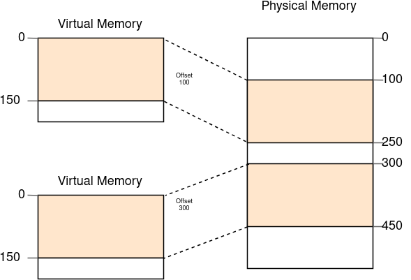
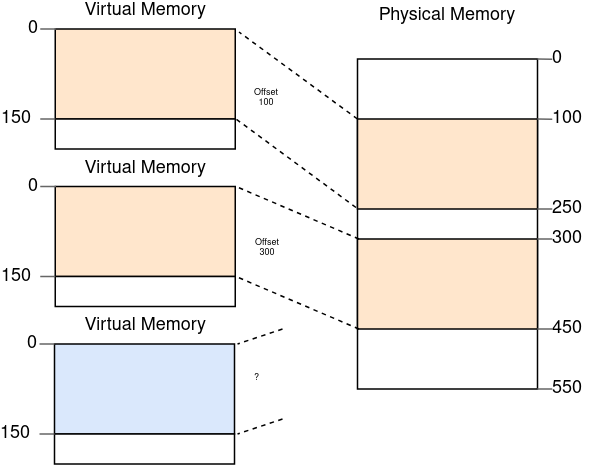
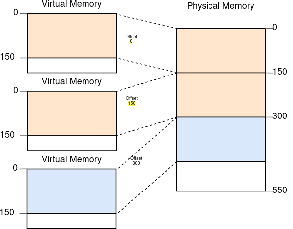
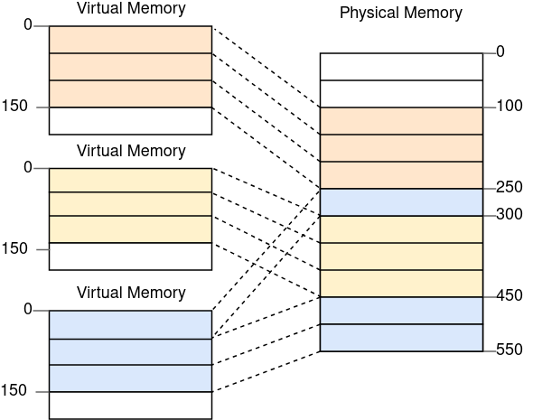
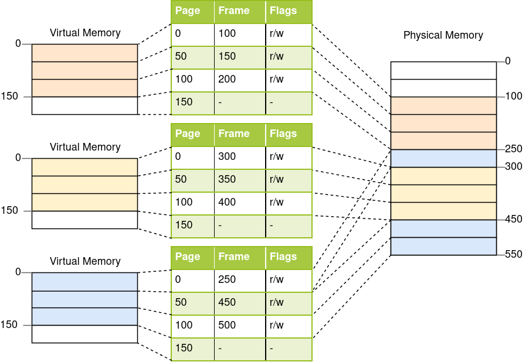
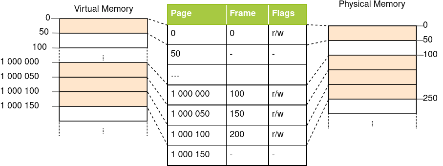
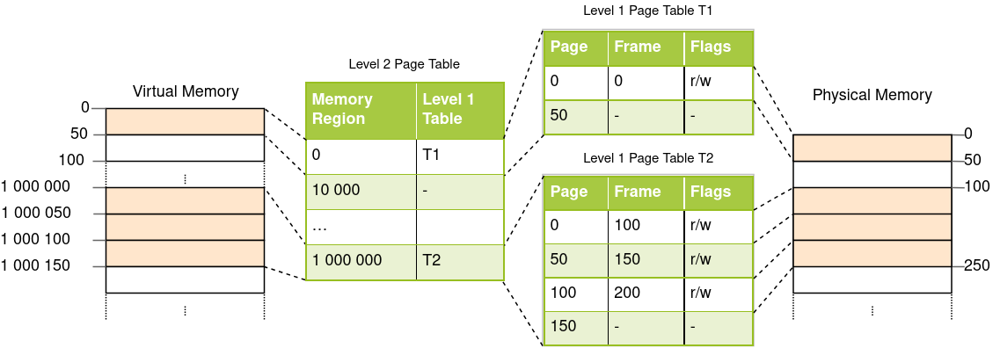
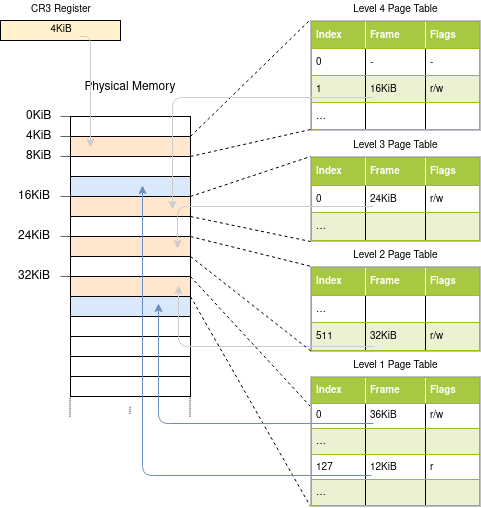
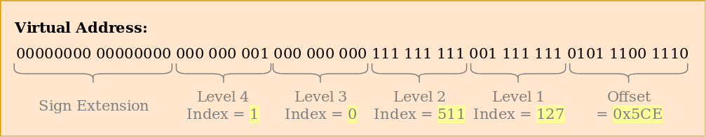
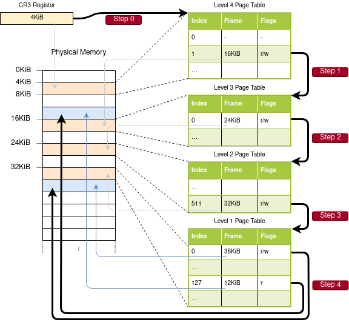

## 内存相关
### 内存保护
- 操作系统的主要任务之一就是隔离各个应用程序的执行环境，比如你的浏览器不应对你的文本编辑器造成影响，因此，操作系统会利用硬件级别的功能确保一个进程无法访问另一个进程的内存区域，但具体实现方式因硬件和操作系统实现而异。在x86架构下，利用**段页式**进行管理。
### 内存分段
大多数系统放弃内存分段技术，而转用内存分页技术，详情见下，所以我们不太深入，只了解一下基本的思想
- CPU可根据内存访问方式自动确定段寄存器的定义：对于指令获取操作，使用代码段寄存器 CS；对于栈操作（入栈/出栈），使用栈段寄存器 SS；对于其他指令，则使用数据段寄存器 DS 或额外段寄存器 ES。另外还有两个后来添加的扩展段寄存器 FS 和 GS，可以随意使用。
- 在最初版本的内存分段中，段寄存器仅仅是直接包含了偏移量（offset），并不包含任何权限控制，直到**保护模式**这个概念的出现。当CPU进入此模式后，段描述符会包含一个本地或全局的 描述符表 索引，它对应的数据包含了offset、段的大小和访问权限。通过加载各个进程所属的全局/本地描述符表，可以实现进程仅能访问属于自己的内存区域的效果，操作系统也由此实现了进程隔离。

- 针对在判断权限前如何更正内存地址这个问题，内存分段使用了一个如今已经高度普及的技术：虚拟内存。
#### 虚拟内存
- 所谓虚拟内存，就是将物理存储器地址抽象为一段完全独立的内存区域，在直接访问物理存储器之前，加入了一个地址转换的步骤。对于内存分页机制而言，地址转换就是在虚拟地址的基础上加入偏移量，如段地址0x1234000，偏移量为 0x1111000 ，对应的物理内存地址是0x1234000+0x1111000= 0x2345000。
- 比如同时执行两个相同的程序：

- 如你所见，这就是两个相同程序的内存分配情况，两者具有不同的地址偏移量（即 段基址）。第一个程序实例的段基址为100，所以其虚拟地址范围0-150换算成物理地址就是100-250。第二个程序实例的段基址为300，所以其虚拟地址范围0-150换算成物理地址就是300-450。所以该机制允许程序共用同一套代码逻辑，使用同样的虚拟地址，并且不会干扰到彼此。
- 该机制的另一个优点就是让程序不局限于特定的某一段物理内存，而是依赖另一套虚拟内存地址，从而让操作系统在不重编译程序的前提下使用全部的内存区域。
#### 内存碎片
- 虚拟内存机制已经让内存分段机制十分强大，但也有碎片化的问题，请看，如果我们同时执行三个程序实例的话：

- 在不能重叠使用的前提下，我们完全找不到足够的地方来容纳第三个程序，因为剩余的连续空间已经不够了。此时的问题在于，我们需要使用 连续 的内存区域，不要将那些中间的空白部分白白浪费掉。
- 比较合适的办法就是暂停程序运行，将内存块移动到一个连续区间内，更新段基址信息，然后恢复程序运行：
  
这样我们就有足够的内存空间来运行第三个程序实例了。
- 但这样做也有一些问题，内存整理程序往往需要拷贝一段比较大的内存，这会很大程度上影响性能，但是又必须在碎片问题变得过于严重前完成这个操作。同时由于其消耗时间的不可预测性，程序很可能会随机挂起，甚至在用户视角下失去响应。
- 这也是大多数系统放弃内存分段技术的原因之一，事实上，该技术已经被x86平台的64位模式所抛弃，因为**内存分页技术**已经完全解决了碎片化问题。

### 内存分页
- 内存分页的思想依然是使用虚拟地址映射物理地址，但是其分配单位变成了固定长度的较小的内存区域。这些虚拟内存块被称为**页 Page**(大小通常为4K Bytes)，而其对应的物理内存则被称为**页帧 Page Frame**，每一Page都可以映射到一个对应的Page Frame中。这也就意味着我们可以将程序所使用的一大块内存区域打散到所有物理内存中(以4K，也就是Page Size为单位)，而不必分配一块连续的区域。
- 其优势就在于，如果我们遇到上文中提到的内存碎片问题时，内存分页技术会这样解决它：
- 例如我们将页的单位设置为50 Bytes，也就是说我们的每一个程序实例所使用的内存都被分割为三页。每一页都可以独立映射到一个页帧中，因此连续的虚拟内存并不一定需要对应连续的物理内存区域，因此也就无需进行内存碎片整理了。

#### 潜在碎片
- 对比内存分段，内存分页选择用较多的较小且固定长度的内存区域代替较少的较大且长度不固定的内存区域。正因为如此，不会有页帧因为长度过小而产生内存碎片。
- 然而这只是 表面上如此，实际上依然存在着名为**内部碎片**的隐蔽内存碎片，造成内部碎片的原因是并非每个内存区域都是分页单位的整数倍。比如一个程序需要101字节的内存，但它依然需要分配3个长度为50字节的页，最终造成了49字节的内存浪费，区别于内存分段造成的内存碎片（有些地方也叫外部碎片），这种情况被称为**内部碎片**（毕竟是发生在Page内部的）。
- 内部碎片虽然也很可恶，但是无论如何也比内存分段造成的内存碎片要好得多，尽管其依然会浪费内存空间，但是无需碎片整理，且碎片数量是可预测的（每一个虚拟内存空间平均会造成半个页帧的内存浪费）。
#### 页表 Page Table
- 我们应当预见到，在操作系统开始运行后，会存在数以百万计的Page-Page Frame映射关系，这些映射关系需要存储在某个地方。分段技术可以为每个活动的内存区域都指定一个段寄存器，但是分页技术不行，因为其使用到的页的数量实在是太多了，远多于寄存器数量，所以分页技术采用了一种叫做**页表**的结构来存储映射信息。
- 以上面的应用场合为例，页表看起来是这样子的：

- 我们可以看到每个程序实例都有其专有的页表，但当前正在活跃的页表指针会被存储到特定的CPU寄存器中，在 x86 架构中，该寄存器被称为**CR3**。操作系统的任务之一，就是在程序运行前，把当前所使用的页表指针推进对应的寄存器中。
- 每次内存访问CPU都会从寄存器获取页表指针，并从页表中获取虚拟地址所对应的页帧，这一步操作完全由硬件完成，对于程序而言是完全透明的。为了加快地址转换的速度，许多CPU架构都加入了一个能够存储最后一次地址转换相关信息的特殊缓存（）
- 根据架构实现的不同，页表也可以在 flags 字段存储一些额外的属性，如访问权限之类。在上面的场景下。 “r/w” 这个 flag 可以使该页同时能够读和写。
#### 多级页表
- 上文中的简单页表在较大的地址空间下会有个问题：太浪费内存了。打个比方，一个程序需要使用4个虚拟内存页 0、1_000_000、1_000_050 和 1_000_100：

- 尽管它仅仅会使用4个页帧，但是页表中有百万级别的映射条目，而我们还不能释放那些空白的条目，因为这会对地址转换造成很大的风险（比如可能无法保证4号页依然对应4号页帧）。
- 我们可以使用**两级页表**来避免内存浪费，其基本思路就是对不同的地址区域使用不同的页表。地址区域和一级页表的映射关系被存储在一个被称为二级页表的额外表格中。
- 举个例子，我们先假设每个一级页表映射**10_000B**的内存空间，在上文所述的应用场合下，此时的页表结构看上去是这样的：

- 虚拟地址中的页**0**位于第一个**10,000**字节的内存区域内，位于内存区域**0**内，对应一级页表**T1**。

- 虚拟地址中的页 **1,000,000**、**1,000,050** 和 **1,000,100** 均可以映射到第 **100** 个 **10,000** 字节的内存区域内（对应二级页表），所以位于内存区域 **1,000,000** 中，该内存区域指向一级页表 **T2**。但这三个页分别对应该一级页表 **T2** 中的页帧 **100**、**150** 和 **200**，因为一级页表中是不存储内存区域偏移量的（我们是算出来偏移量offset然后去找帧号）。

- 比如说，要表示虚拟地址**1,000,050**所对应的物理地址，可以按照以下步骤进行：
1. 确定页号：假设每页的大小为 **10,000** 字节，那么 **1,000,050** (在二级页表中)所在的页号为 **1,000,050** / **10,000** = 100（取整），对应了level 2页表的Region（1_000_000），确认了level 1页表T2。
2. 确定帧号：根据描述，此时**1,000,050** % **10,000** = 50（在T2的偏移量为50的地方），确认帧号，对应一级页表 T2 中的页帧 **150**。
3. 也就是说，虚拟地址 **1,000,050** 被分解为页号和帧号。页号 **100** 对应二级页表中的一个条目，该条目指向一级页表 **T2**。在一级页表 T2 中，偏移量 **50** 对应页帧 **150**，这样我们就找到了**1,000,050**对应的物理地址帧号**150**。

- 在这个场合中，二级页表中还是出现了 **100** 个被浪费的位置（在lebel 2页表中），不过无论如何也比之前数以百万计的浪费好多了，因为我们没有额外创建指向 **10,000** 到 **1,000,000** 这段内存区域的一级页表。
- 同理，两级页表的原理可以扩展到三级、四级甚至更多的级数。通常而言，可以让页表寄存器指向最高级数的表，然后一层一层向下寻址，直到抵达一级页表，获取页帧地址。这种技术就叫做**多级**或**多层**页表。

- 那么现在我们已经明白了内存分页和多级页表机制的工作原理，下面我们会探索一下在 **x86_64** 平台下内存分页机制是如何实现的（假设 CPU 运行在 **64 位**模式下）。
<h3 id="x86_64">页表格式</h3>
### x86_64中的分页
- x86_64 平台使用4级页表，页大小为4KiB，无论层级，每个页表均具有512个条目，每个条目占用8字节，所以每个页表固定占用 512 * 8B = 4KiB，正好占满一个内存页。

- 每一级的页表索引号都可以通过虚拟地址推导出来：

- 我们可以看到，每个表索引号占据 9 个比特，这当然是有道理的，每个表都有 2^9 = 512 个条目，低12位用来表示内存页的偏移量（2^12 bytes = 4KiB，而上文提到页大小为4KiB）。第 48-64 位毫无用处，这也就意味着 x86_64 并非真正的 64 位，因为它实际上支持 48 位地址（当然，根据摩尔定律，以后肯定是能用上的QWQ）。
- 尽管48-64位毫无用处，但依然不被允许随意赋值，而是必须将其设置为与47位相同的值以保证地址唯一性，由此留出未来对此进行扩展的可能性，如实现5级页表。该技术被称为 符号扩展，理由是它与 二进制补码 机制真的太相似了。当地址不符合该机制定义的规则时，CPU会抛出异常。
- 值得注意的是，英特尔最近发布了一款代号是冰湖的CPU，它的新功能之一就是可选支持能够将虚拟地址从48位扩展到57位的 5级页表。但是针对一款特定的CPU做优化在现阶段并没有多少意义，所以本文仅会涉及标准的4级页表。
#### 地址转换范例
- **PGD** (Page Global Directory)
  - **PUD** (Page Upper Directory)
    - **PMD** (Page Middle Directory)
      - **PT** (Page Table)
        - **物理页帧** (Physical Page Frame)
- 请看下图，这就是一个典型的地址转换过程的范例：（怕你们忘了，cr3 寄存器保存了当前正在使用的页全局目录PGD的物理地址。这个地址是多级页表转换过程的起点）  

- 在每一级的页表（除一级页表外）中，都存在着指向下一级页表的指针，1级页表则存放着直接指向页帧地址的指针。注意，这里的指针，都是指页表的**物理地址**！！，而非虚拟地址，否则CPU会因为需要进行额外的地址转换而陷入无限递归中。（因为一旦要从虚拟地址->物理地址，就要查页表，查页表还给你返回虚拟地址，又要你从虚拟地址->物理地址，那不就套娃了嘛0.0）
- 最终，寻址结果是上图中的两个蓝色区域，根据页表查询结果，它们的虚拟地址分别是 **0x803FE7F000** 和 **0x803FE00000**，那么让我们看一看当程序尝试访问内存地址 **0x803FE7F5CE** 时会发生什么事情。首先我们需要把地址转换为二进制，然后确定该地址所对应的页表索引和页偏移量：

- 通过这些索引，我们就可以通过依次查询多级页表来定位最终要指向的页帧：
    1. 首先，我们需要从 CR3 寄存器中读出4级页表的物理地址。
    2. 4级页表的索引号是1，所以我们可以看到3级页表的地址是16KiB。
    3. 载入3级页表，根据索引号0，确定2级页表的地址是24KiB。
    4. 载入2级页表，根据索引号511，确定1级页表的地址是32KiB。
    5. 载入1级页表，根据索引号127，确定该地址所对应的页帧地址为12KiB，使用Hex表达可写作 0x3000。
    6. 最终步骤就是将最后的页偏移量拼接到页帧地址上，即可得到物理地址，即 0x3000 + 0x5ce = 0x35ce。

- 由上图可知，该页帧在一级页表中的权限被标记为**r**，即只读，硬件层面已经确保当我们试图写入数据的时候会抛出异常。较高级别的页表的权限设定会覆盖较低级别的页表，如3级页表中设定为只读的区域，其所关联的所有下级页表对应的内存区域均会被认为是只读，低级别的页表本身的设定会被忽略。
- 注意，示例图片中为了简化显示，看起来每个页表都只有一个条目，但实际上，4级以下的页表每一层都可能存在多个实例，其数量上限如下：

    - 1个4级页表
    - 512个3级页表（因为4级页表可以有512个条目）
    - 512*512个2级页表（因为每个3级页表可以有512个条目）
    - 512*512*512个1级页表（因为每个2级页表可以有512个条目）
#### 页表格式
在 x86_64 平台下，页表是一个具有512个条目的数组，于Rust而言就是这样：（没学过rust就不用管啦）
```rust
#[repr(align(4096))]
pub struct PageTable {
    entries: [PageTableEntry; 512],
}
```
每个页表条目长度都是 8 字节（64 比特），其内部结构如下：（4096/512=8）

| Bit(s)  | 名字                  | 含义                                                                 |
|---------|-----------------------|----------------------------------------------------------------------|
| 0       | present               | 该页目前在内存中                                                    |
| 1       | writable              | 该页可写                                                            |
| 2       | user accessible       | 如果没有设定，仅内核代码可以访问该页                                |
| 3       | write through caching | 写操作直接应用到内存                                                |
| 4       | disable cache         | 对该页禁用缓存                                                      |
| 5       | accessed              | 当该页正在被使用时，CPU 设置该比特的值                              |
| 6       | dirty                 | 当该页正在被写入时，CPU 设置该比特的值                              |
| 7       | huge page/null        | 在 P1 和 P4 状态时必须为 0，在 P3 时创建一个 1 GiB 的内存页，在 P2 时创建一个 2 MiB 的内存页 |
| 8       | global                | 当地址空间切换时，该页尚未应用更新（CR4 寄存器中的 PGE 比特位必须一同被设置） |
| 9-11    | available             | 可被操作系统自由使用                                                |
| 12-51   | physical address      | 经过 52 比特对齐过的页帧地址，或下一级的页表地址                    |
| 52-62   | available             | 可被操作系统自由使用                                                |
| 63      | no execute            | 禁止在该页中运行代码（EFER 寄存器中的 NXE 比特位必须一同被设置）     |
- 我们可以看到，仅12–51位会用于存储页帧地址或页表地址，其余比特都用于存储标志位，或由操作系统自由使用。 其原因就是，该地址总是指向一个4096字节对齐的地址、页表或者页帧的起始地址。 这也就意味着0-11位始终为0，没有必要存储这些东西，硬件层面在使用该地址之前，也会将这12位比特设置为0，52-63位同理，因为x86_64平台仅支持52位物理地址（类似于上文中提到的仅支持48位虚拟地址的原因）。
- 进一步说明一下可用的标志位：（大概看看就好）
    - **present** 标志位并非是指未映射的页，而是指其对应的内存页由于物理内存已满而被交换到硬盘中，如果该页在换出之后再度被访问，则会抛出 page fault 异常，此时操作系统应该将此页重新载入物理内存以继续执行程序。
    - **writable** 和 **no execute** 标志位分别控制该页是否可写，以及是否包含可执行指令。
    - **accessed** 和 **dirty** 标志位由 CPU 在读写该页时自动设置，该状态信息可用于辅助操作系统的内存控制，如判断哪些页可以换出，以及换出到硬盘后页里的内容是否已被修改。
    - **write through caching** 和 **disable cache** 标志位可以单独控制每一个页对应的缓存。
    - **user accessible** 标志位决定了页中是否包含用户态的代码，否则它仅当 CPU 处于核心态时可访问。该特性可用于在用户态程序运行时保持内核代码映射以加速系统调用。然而，Spectre 漏洞会允许用户态程序读取到此类页的数据。
    - **global** 标志位决定了该页是否会在所有地址空间都存在，即使切换地址空间，也不会从地址转换缓存（参见下文中关于 TLB 的章节）中被移除。一般和 **user accessible** 标志位共同使用，在所有地址空间映射内核代码。
    - **huge page** 标志位允许 2 级页表或 3 级页表直接指向页帧来分配一块更大的内存空间，该标志位被启用后，页大小会增加 512 倍。就结果而言，对于 2 级页表的条目，其会直接指向一个 2 MiB = 512 * 4 KiB 大小的大型页帧，而对于 3 级页表的条目，就会直接指向一个 1 GiB = 512 * 2 MiB 大小的巨型页帧。通常而言，这个功能会用于节省地址转换缓存的空间，以及降低逐层查找页表的耗时。
- x86_64 crate 为我们提供了 page tables 的结构封装，以及其内部条目 entries，所以我们无需自己实现具体的结构。
#### 地址转换后备缓冲区（TLB）
- 显而易见，4级页表使地址转换过程变得有点慢，每次转换都需要进行4次内存访问。为了改善这个问题，x86_64平台将最后几次转换结果放在所谓的 地址转换后备缓冲区（TLB）中，这样对同样地址的连续重复转换就可以直接返回缓存中存储的结果。
- 不同于CPU缓存，TLB并非是完全对外透明的，它在页表变化时并不会自动更新或删除被缓存的结果。这也就是说，内核需要在页表发生变化时，自己来处理TLB的更新。针对这个需要，CPU也提供了一个用于从TLB删除特定页的缓存的指令 invlpg （“invalidate page”），调用该指令之后，下次访问该页就会重新生成缓存。不过还有一个更彻底的办法，通过手动写入 CR3 寄存器可以制造出模拟地址空间切换的效果，TLB也会被完全刷新。x86_64 crate 中的 tlb module 提供了上面的两种手段，并封装了对应的函数。
- 请注意，在修改页表之后，同步修改TLB是十分十分重要的事情，不然CPU可能会返回一个错误的物理地址，因为这种原因造成的bug是非常难以追踪和调试的。

### Linux是怎么干的？
Linux 系统主要采用了分页管理，但是由于 Intel 处理器的发展史，Linux 系统无法避免分段管理。于是 Linux 就把所有段的基地址设为 0，也就意味着所有程序的地址空间都是线性地址空间（虚拟地址），相当于屏蔽了 CPU 逻辑地址的概念，所以段只被用于访问控制和内存保护。


