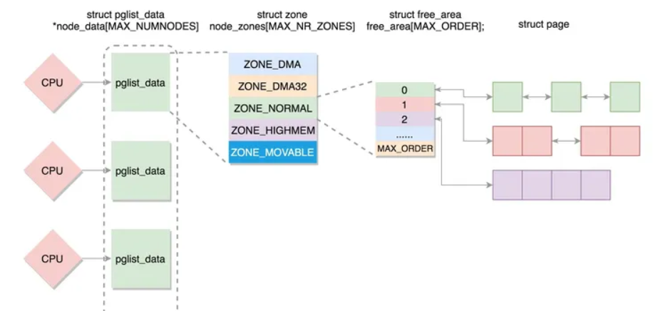
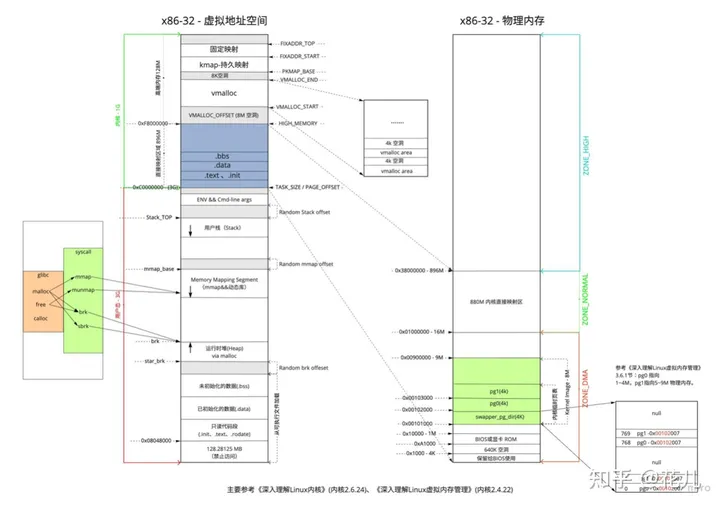
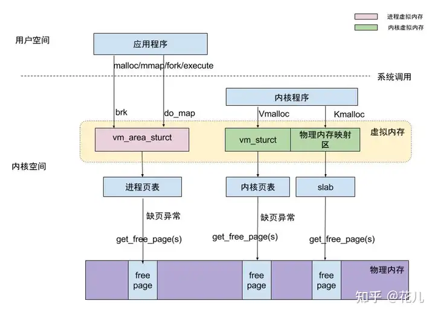
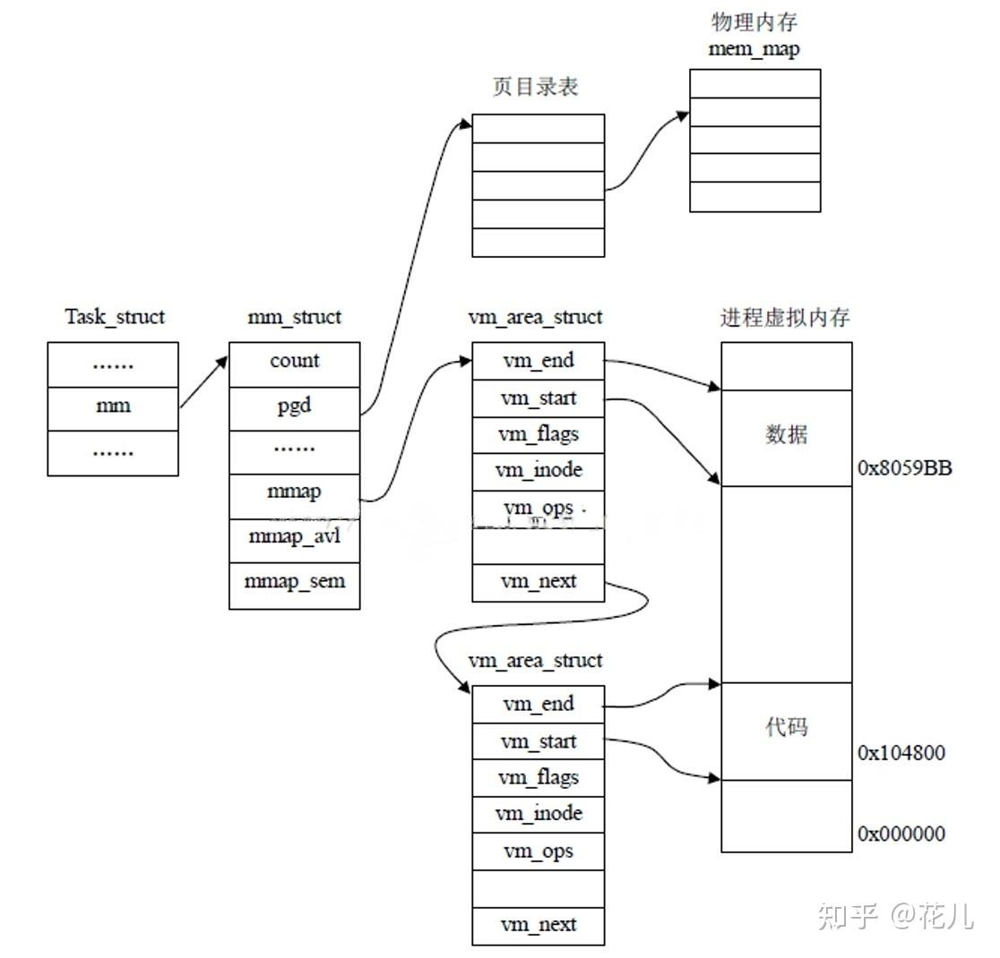

### 操作系统如何知道计算机物理内存大小？
在计算机电启动的时候，**bios**会检测并计算pa的大小（具体涉及针脚和电平的操作省略...），并且向操作系统提供查询的接口，这个接口就是0x15中断，其中重点参数是ax中需要设置值为e820，然后通过intcall(0x15, &ireg, &oreg)中断调用，由bios通过oreg.di出参（输出参数）将内存信息返回回来。该实现在[/arch/x86/boot/memory.c的detect_memory](https://code.dragonos.org.cn/xref/linux-6.6.21/arch/x86/boot/memory.c#25),由于代码出参oreg.di也是ireg.di传进去的值，所以代码里面直接读了buf空间内存。由于每调用一次intcall只会返回一条内存数据信息，所以会循环调用多次才能够探明整个内存空间。

### kernel会加载到哪里呢？
linux内核是压缩在vmlinux.bin.gz里面的，在vmlinuz里里有指示vmlinux的加载地址信息（通常是0x100000）和vmlinux.bin.gz解压的地址信息（0x1000000）。不过这都是建议值，内核是有自我防护的（认为用户都是恶意的），可能会因一些状况加载到别处。这里对vmlinuz之类的名词不用太深究，只用知道kernel通常会加载到0x1000000，但现实没有那么通常（世界还是坏人多QWQ）

#### 内核的自我防护
默认的情况下，kernel的映像是加载到了0x1000000的位置，由此攻击者分分钟可以通过地址偏移找到内核关键数据的位置，从而借助内核的越界、任意地址读写等漏洞发起攻击。因此kernel隐匿自己的位置可以很好地增加攻击者的难度，从而起到自我防护。所以引入了KASLR（kernel address space layoutrandomization），即内核地址空间布局随机化。该功能实现在[arch/x86/boot/kaslr.c](https://code.dragonos.org.cn/xref/linux-6.6.21/arch/x86/boot/compressed/kaslr.c#842)，由head_32()调用extract_kernel()执行kernel映像解压的时候，通过choose_random_location()调用find_random_phys_addr()使用随机值计算出加载位置。在32位环境下，它将随意挑选内核加载位置（>3G），通过随机值，结合来自elf的内存描述信息或者e820修整。该功能配置项为CONFIG_RANDOMIZE_BASE，也可以通过内核启动参数“nokaslr”进行关闭。

### https://zhuanlan.zhihu.com/p/470783392
我们都知道在用户空间动态申请内存用的函数是 malloc()，这个函数在各种操作系统上的使用是一致的，对应的用户空间内存释放函数是 free()。注意：动态申请的内存使用完后必须要释放，否则会造成内存泄漏，如果内存泄漏
发生在内核空间，则会造成系统崩溃。
那么，在内核空间中如何申请内存呢？一般我们会用到 kmalloc()、kzalloc()、vmalloc() 等
#### kmalloc()
    void *kmalloc(size_t size, gfp_t flags)；//传入大小和标志位
- kmalloc() 申请的内存位于物理内存映射区域，而且在物理上也是连续的，它们与真实的物理地址只有一个固定的偏移，因为存在较简单的转换关系，所以对申请的内存大小有限制，不能超过128KB。
- flags的用法（大概了解一下）

| 用法描述                          | 标志位                |
|-----------------------------------|-----------------------|
| 进程上下文，可以睡眠              | GFP_KERNEL            |
| 进程上下文，不可以睡眠            | GFP_ATOMIC            |
| 用于 DMA 的内存，可以睡眠         | GFP_DMA \| GFP_KERNEL |
| 用于 DMA 的内存，不可以睡眠       | GFP_DMA \| GFP_ATOMIC |
对应的内存释放函数为：
    void kfree(const void *objp);

#### kzalloc()
- kzalloc() 函数与 kmalloc() 非常相似，参数及返回值是一样的，可以说是前者是后者的一个变种，因为 kzalloc() 实际上只是额外附加了__GFP_ZERO标志。所以它除了申请内核内存外，还会对申请到的内存内容清零。
- kzalloc() 对应的内存释放函数也是 kfree()。

#### vmalloc()
- 函数原型：
    void *vmalloc(unsigned long size);
- vmalloc() 函数则会在虚拟内存
空间给出一块连续的内存区，但这片连续的虚拟内存在物理内存中并不一定连续。由于 vmalloc() 没有保证申请到的是连续的物理内存，因此对申请的内存大小没有限制，如果需要申请较大的内存空间就需要用此函数了。
- 对应的内存释放函数为：
    void vfree(const void *addr);
- 注意：vmalloc() 和 vfree() 可以睡眠，因此不能从中断上下文调用。

#### 物理内存基础
Linux中内存分为3个级别，从下到上依次为：

1. Page： 一个page的大小为 4k， Page 是内存的一个最基本的单位。

2. Zone： Zone中提供了多个队列来管理page。

Zone分为3种：

- ZONE_DMA: 用来存放DMA读取IO设备的数据，内核专用
- ZONE_NORMAL: 用来存放内核的相关数据，内核专用
- ZONE_HIGHMEM: 高端内存，用来用户进程存放数据

    如果物理内存是5g，而32位最大寻址是4g，所以需要highmem zone去映射多出来的1g，这部分采用临时页表。64位只有normal，没其他的。

3. Node 节点：

一个CPU对应着一个Node，一个Node包括一个Zone_DMA、 ZONE_NORMAL、ZONE_HIGHMEM。同时当一个CPU对应的内存用光后，可以申请其他CPU对应的内存。

#### 虚拟地址空间（以32bit 4G内存为例）
3G低地址虚拟内存空间为用户空间，高地址1G空间为内核空间，内存空间分为三部分：
1. 128M高端内存空间（HIGH_MEM）:包括固定映射区，持久映射区和vmalloc区。固定映射区只能被某些特定函数使用；持久映射区一个虚拟地址只能映射一个物理地址，支持解绑映射到其它物理地址；vmalloc通过内核页表区访问内存
2. 896M内核直接映射区：减去偏移值offset直接映射到物理地址。
3. 896-4G高端内存区域：用户空间动态映射区，不可以直接映射到内核空间。从低地址到高地址分段依次为：.text只读代码区(比如函数方法)、.data已初始化数据段（比如已初始化的静态/全局变量）、.bss未初始化数据段、堆、mmap映射区、栈、环境变量等。

内核空间只能被内核申请使用，用户进程只能操作用户空间的物理内存和虚拟空间。所以当调用内核空间读取文件或者网络数据的时候，首先会将数据拷贝到内核空间，然后在将数据从内核空间拷贝到用户空间，因为用户进程不能访问内核空间。
#### 内存访问
用户空间的应用程序通过系统调用systemcall，向内核空间申请内存访问，此时其对应的代码和数据运行在内核空间中。pcb查询进程页表获得对应的物理内存地址，触发缺页中断page fault，由mmu完成内存的分配和映射。同样，内核应用程序也可以通过内核页表触发page fault分配内存，除此之外，还可以通过buddy/slab系统申请到内存。

##### 3.1 系统调用brk和do_map两种分配方式的异同
共同点：这两种方式分配的都是虚拟内存，没有分配物理内存。在第一次访问已分配的虚拟地址空间的时候，发生缺页中断，操作系统负责分配物理内存，然后建立虚拟内存和物理内存之间的映射关系。

目标的地址空间不同：brk是将数据段(.data)的最高地址指针_edata往高地址推，即堆区；do_map是在进程的虚拟地址空间中（堆和栈中间，称为文件映射区域的地方）找一块空闲的虚拟内存。

分配条件不同：malloc小于128k的内存，使用brk分配内存（kmalloc？）；大于128k时使用do_map申请内存

释放方式不同：brk分配的内存需要等到高地址内存释放以后才能释放（例如，在B释放之前，A是不可能释放的，这就会产生内存碎片，而mmap分配的内存可以单独释放。
##### 3.2 PCB中的内存管理
*pgd：指向存放该内存区中页的全局目录。

vm_area_struct: 每个struct对应进程虚拟内存中一个段。进程中的vm_area_struct数目较少时，以图中单链表的形式排列，结构体数目多时，为了提升索引和更新速度，使用“R-B Tree”数据结构组织数据。

#### buddy/slab伙伴系统
伙伴系统把相同大小的连续页框块用链表串起来，所有的空闲页框分组为11块链表，每个块链表分别包含大小为1，2，4，8，16，32，64，128，256，512和1024个连续页框的页框块，即2的0~10次方，最大可以申请1024个连续页框，对应4MB(1024 * 4k)大小的连续内存，解决内存外部碎片问题。

因为任何正整数都可以由 2^n 的和组成，所以我们总能通过拆分与合并，来找到合适大小的内存块分配出去，减少了外部碎片产生 。

举例：我们要分配1MB的空间，即256个页框的块。buddy system会先去查找在256个页框的链表中是否存在空闲块，如果没有则继续查找512个页框的链表，如果存在空闲块，则将其拆分为两个256个页框的块，一个用来进行分配，另一个则放入256个页框的链表中。释放时也同理，它会将多个连续且空闲的页框块进行合并为一个更大的页框块，放入更大的链表中。

slab分配器将几个页单独拿出来作为缓存，以字节为单位对小块内存进行分配，是对伙伴系统的补充。slab既可以避免内存内部碎片化问题，又提高了内存分配的性能。

对于内核中需要重复使用的小型数据对象，slab通过一个缓存池来缓存这些常用的已初始化的对象。当我们需要申请这些小对象时，就会直接从缓存池中的slab列表中分配一个出去。而当我们需要释放时，我们不会将其返回给伙伴系统进行释放，而是将其重新保存在缓存池的slab列表中。
#### MMAP映射
基于传统的IO方式，底层实际上通过调用read()和write()来实现。

通过read()把数据从硬盘读取到内核缓冲区，再复制到用户缓冲区；然后再通过write()写入到socket缓冲区，最后写入网卡设备。整个过程发生了4次用户态和内核态的上下文切换
和4次拷贝，具体流程如下：

什么是DMA拷贝呢？

因为对于一个IO操作而言，都是通过CPU发出对应的指令来完成，但是相比CPU来说，IO的速度太慢了，CPU有大量的时间处于等待IO的状态。因此就产生了DMA（Direct Memory Access）直接内存访问
技术，本质上来说他就是一块**主板上独立的芯片**，通过它来进行内存和IO设备的数据传输，从而减少CPU的等待时间。但是无论谁来拷贝，频繁的拷贝耗时也是对性能的影响。
##### mmap+write方式
mmap主要实现方式是将读缓冲区的地址和用户缓冲区的地址进行映射，内核缓冲区和应用缓冲区共享，从而减少了从读缓冲区到用户缓冲区的一次CPU拷贝。

mmap 提供了一种机制，让用户程序直接访问设备内存，比在用户空间和内核空间互相拷贝数据，效率更高，mmap映射内存必须是页面大小的整数倍。

优点：
- 对文件的读取操作跨过了页缓存，减少了数据的拷贝次数，用内存读写取代I/O读写，提高了文件读取效率
- 现了用户空间和内核空间的高效交互方式
- 提供进程间共享内存及相互通信的方式，包括父子进程
- 虚拟内存技术：可用于实现高效的大规模数据传输，内存空间不足时可以用磁盘空间代替内存

虚拟内存指的是将硬盘中划出一段 swap分区当作虚拟的内存，用来存放内存中暂时用不到的内存页，等到需要的时候再从 swap 分区中将对应的内存页调入到内存中， 硬盘此时相当于一个虚拟的内存，因此需要做文件映射。

从逻辑上能够运行更大内存的程序，因为程序运行的时候并不需要把所有数据都加载到内存中，只需要将当前运行必要的相关程序和数据加载到内存中就可以了，当需要其他数据和程序的时候，再将其调入。

相较于真正的内存加载，虚拟内存需要将数据在内存和磁盘中不断切换，这是一个耗时的操作，所以速度比不上真正的内存加载。