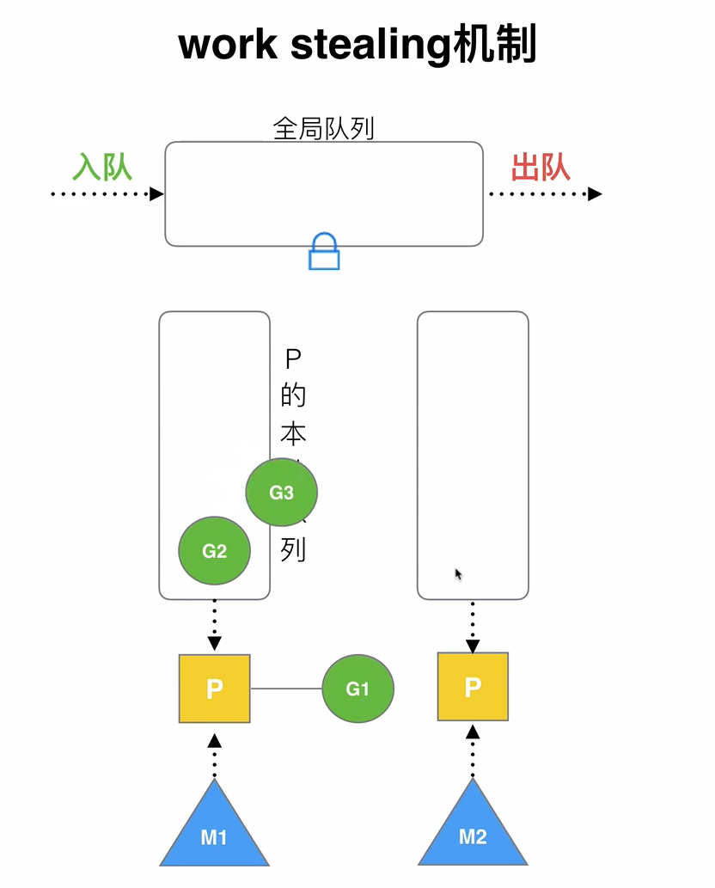
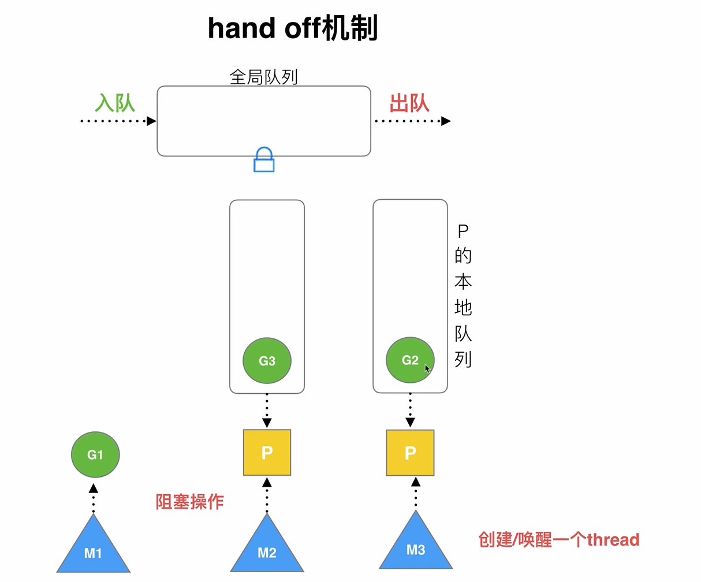
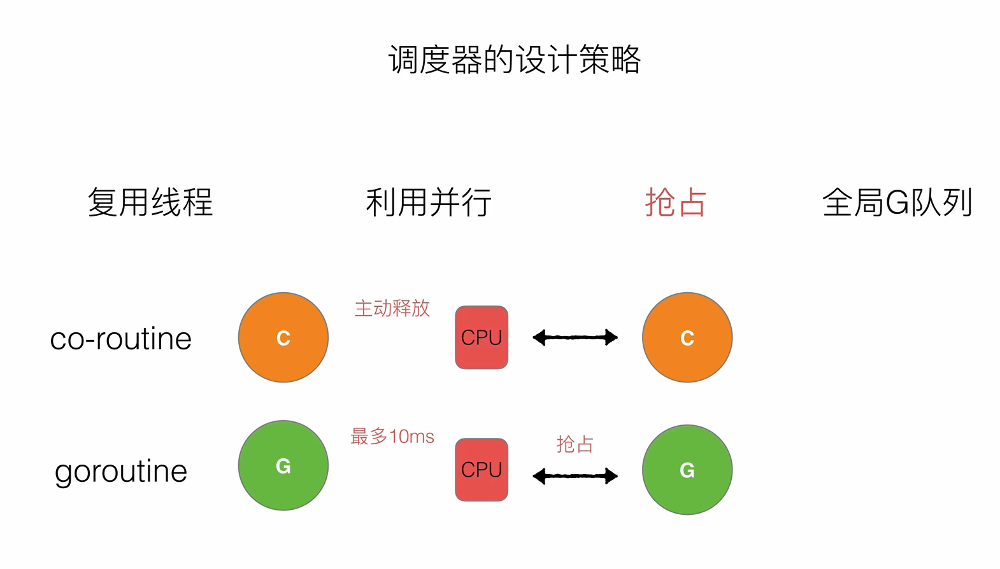
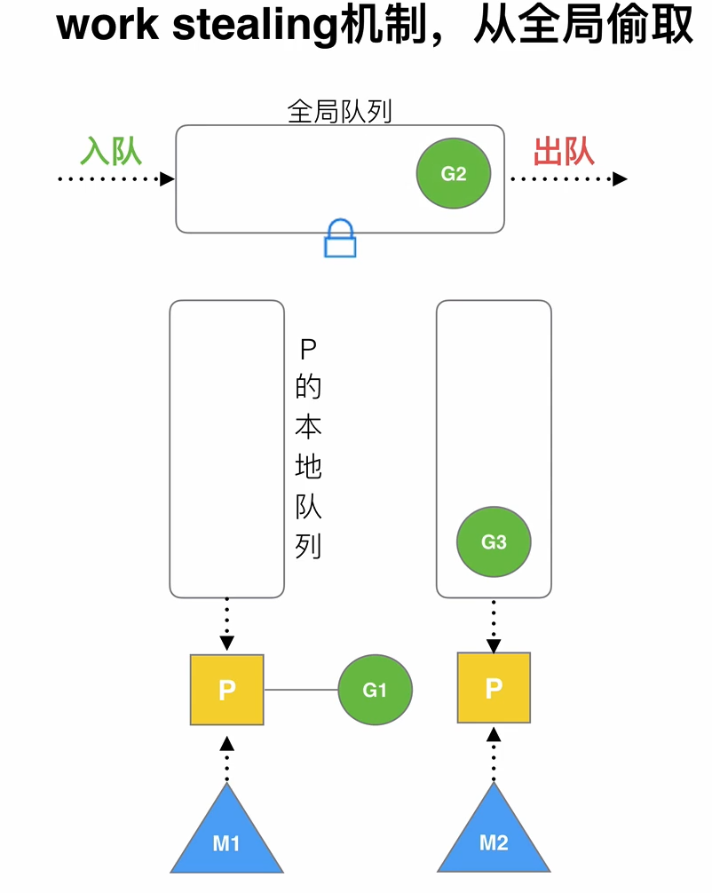
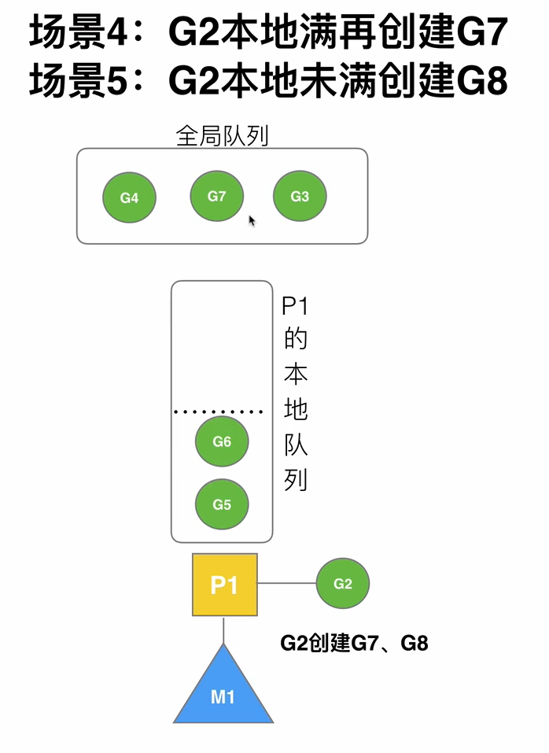
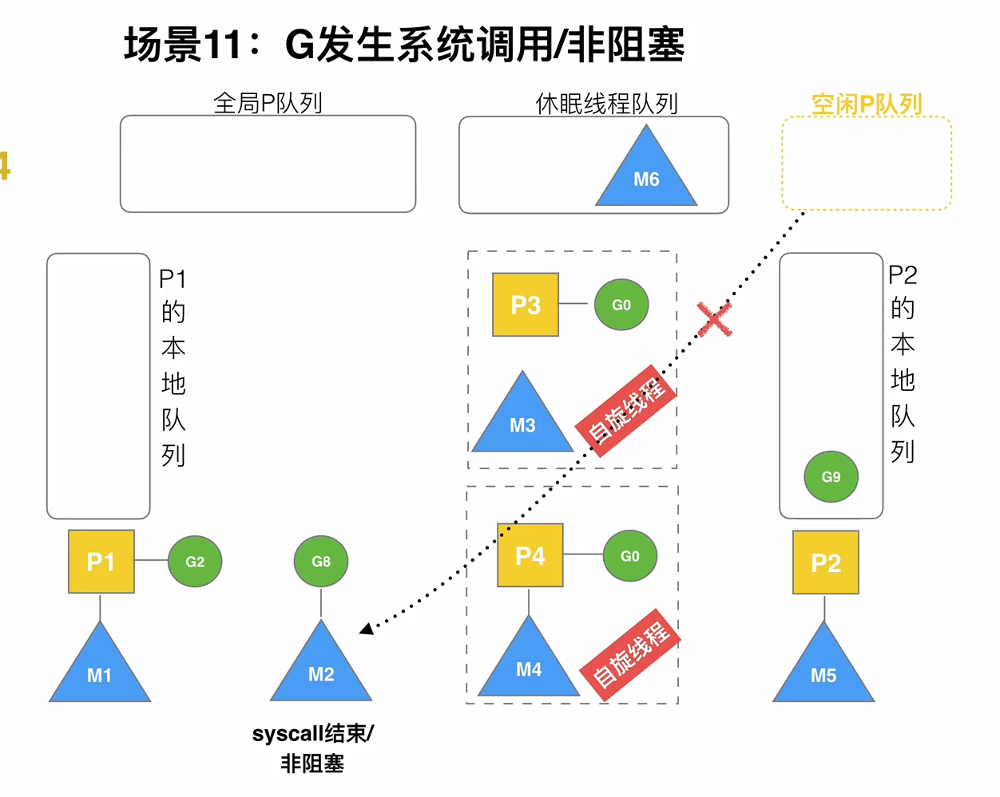

# Golang 的 GPM 调度器
Go 语言的 GPM 调度器是其并发模型的核心，它负责高效地调度 Goroutine（Go 的轻量级线程）在操作系统线程（OS Thread）上运行。GPM 调度器的设计目标是实现高并发、低延迟和高吞吐量。
## 背景：为什么要有 GPM 调度器？
### 高并发需求：
- Go 语言的设计目标之一是支持高并发编程。传统的线程模型（如操作系统线程）创建和切换的开销较大，无法满足高并发的需求。
- Goroutine 是 Go 的轻量级线程，创建和切换的开销非常小，但需要一种高效的调度机制来管理大量的 Goroutine。

### 减少上下文切换开销：
- 操作系统线程的上下文切换涉及内核态和用户态的切换，开销较大。
- GPM 调度器在用户态实现调度，避免了频繁的内核态切换。
- 
### 充分利用多核 CPU：
- GPM 调度器能够将 Goroutine 均匀地分配到多个 CPU 核心上运行，充分利用多核 CPU 的计算能力。

## 核心数据结构：G、P、M
### G（Goroutine）：
- 表示一个 Goroutine，包含 Goroutine 的栈、程序计数器（PC）、状态等信息。
- Goroutine 是 Go 并发的基本单位，比操作系统线程更轻量。

### P（Processor）：
- 表示一个逻辑处理器，负责管理 Goroutine 的运行。
- 每个 P 都有一个本地 Goroutine 队列（Local Queue），用于存储待运行的 Goroutine。
- P 的数量默认等于 CPU 核心数，可以通过 GOMAXPROCS 调整。

### M（Machine）：
- 表示一个操作系统线程（OS Thread）。
- M 负责执行 Goroutine，每个 M 必须绑定一个 P 才能运行 Goroutine。
- M 的数量通常大于 P 的数量，因为可能存在阻塞的系统调用。

## 调度逻辑
### 正常情况下
每个 P 维护一个本地 Goroutine 队列。M 绑定一个 P 后，从 P 的本地队列中获取 Goroutine 到P的G0并执行,如果本地队列为空，M 会从全局队列（Global Queue）或其他 P 的本地队列中偷取（Work Stealing）Goroutine。

### 挂起和恢复情况下
当 Goroutine 发生阻塞（如系统调用、channel 操作）时，M会阻塞，然后会再创建一个M,如果M有空闲，就会回首或睡眠,所以是M的数量是动态开辟销毁的。P是通过GOMAXPROC来设置的

### 负载均衡情况
如果某个 P 的本地队列过载，调度器会将部分 Goroutine 移动到全局队列。M 在空闲时会从其他 P 的本地队列中偷取 Goroutine，实现负载均衡。

### 抢占式调度
Go 1.14 引入了基于信号的抢占式调度，防止长时间运行的 Goroutine 独占 CPU。调度器会定期检查 Goroutine 的运行时间，如果超时，会强制切换 Goroutine。

## 调度器的设计策略
全局队列和P的是在M0初始化的，比如main
### 复用线程
#### Work stealing 机制
批量偷，选被偷队列的后一半G

#### hand off 

### 利用并行
- GOMAXPROCS 限定P的个数 = CPUs/2
### 抢占

### 全局G队列
要是P里面没有了就从全局G队列里面偷

## P满了又有G要加入怎么办

会把前一半队列（随机打乱）以及新的G放到全局队列，后面的G顺下来

## GPM的负载均衡
自旋线程通过某个固定的公式从全局队列里面批量获取G，自选线程是不想老创建或者销毁线程（抢占全局并非抢占P）

## G从阻塞变成非阻塞
G不在P里是执行不了的，所以：
- G
1. 找到原配P
2. 尝试去空闲P里面
3. 到全局队列
- M: 到休眠队列

